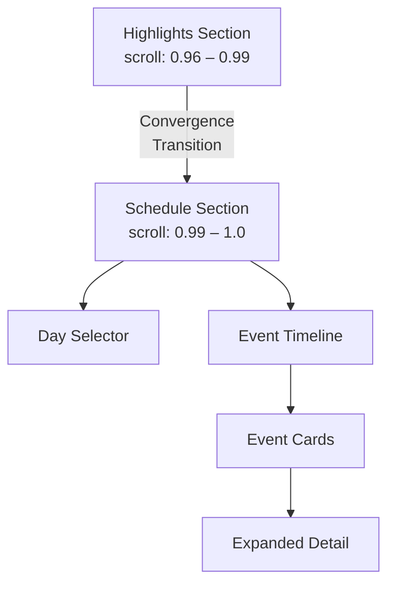

# Schedule Section — Design Research & Concepts

Deep research into transition effects, layout patterns, and interaction design for the **Schedule Section** following the Highlights floating gallery.

---

## 1. Transition: Highlights → Schedule

The Highlights section is a free-floating, edge-spawning photo gallery on a deep-dark backdrop (`#0a0a1a → #020208`). The transition into Schedule needs to feel like the chaotic, organic energy of memories is being **focused and organized into a structured timeline**. Here are the top candidates, ranked by impact:

### Option A — ★ **"Convergence" (Recommended)**
> Floating images accelerate towards the center of the screen, shrinking and blurring as they converge into a single bright point. The point pulses once, then **expands as a radial wipe** revealing the Schedule section beneath.

**Why it works:** It narratively bridges "scattered memories" → "organized plan." The convergence mimics a gravitational pull, the pulse feels like a heartbeat, and the radial reveal is cinematic.

**Technical approach:**
- During the last `~0.02` of scroll range, all active `SpawnedImage` elements get their velocity overridden to point toward `(50vw, 50vh)`
- Scale dampens to `0` with `easeInExpo`
- A CSS `radial-gradient` mask expands from center, revealing the Schedule container behind
- Total duration: ~1.5s auto-timed (similar to existing title reveal pattern)

---

### Option B — **"Gravity Drain"**
> Images slowly drift downward as if gravity is increasing. They fall off the bottom of the viewport one by one (staggered by layer — background first, foreground last). Screen goes to pure black. Then the Schedule fades in from the bottom with a subtle upward float.

**Why it works:** The gravity metaphor feels natural. Background images falling first creates a satisfying depth peel. Very elegant, less complex.

**Technical approach:**
- Override `vy` to increasing positive values (images fall down)
- Stagger by layer: `background` falls at `t=0`, `middle` at `t+0.3`, `foreground` at `t+0.6`
- After all images exit, `0.5s` black hold, then Schedule fades in with `translateY(30px) → 0`

---

### Option C — **"Dissolve Morph"**
> Images individually dissolve (opacity → 0 with a pixel-scatter/noise effect) while simultaneously, schedule cards begin forming in their place — as if the photos are **reassembling into a new structure**. Think of sand particles reforming.

**Why it works:** Most technically impressive. Creates a direct visual link between the two sections. Feels truly premium.

**Technical approach:**
- CSS `mask-image` with an animated noise texture on each image
- Simultaneously, schedule event cards fade in at corresponding positions
- Cards then animate (FLIP-style) to their final grid positions
- Requires careful choreography but the payoff is extraordinary

---

### Option D — **"Curtain Pull"**
> A horizontal split — the floating images "pull apart" left and right like stage curtains, revealing the schedule section behind. The images on the left half move left, the right half move right, with a slight rotation.

**Why it works:** Theatrical. References the "behind the curtain" highlights content. Feels deliberate and dramatic.

---

### Option E — **"Depth Zoom Through"**
> Camera-style zoom through the floating images — they rush past the viewer (scaling up and moving to edges) as if you're flying through them. The Schedule section is revealed as the "destination" at the end of the tunnel.

**Why it works:** Mirrors the existing tunnel transition from earlier in the experience. Creates a visual callback. Very immersive.

---

## 2. Schedule Section — Layout Concepts

### Layout A — ★ **"Split Timeline" (Recommended)**


```
┌─────────────────────────────────────────────────────┐
│                                                     │
│  ┌─────────┐    ┌─────────────────────────────────┐ │
│  │  DAY 1  │    │  ┌─ 10:00 ─────────────────┐   │ │
│  │  Feb 25 │    │  │ ● Opening Ceremony       │   │ │
│  │         │    │  │   Main Stage              │   │ │
│  ├─────────┤    │  └───────────────────────────┘   │ │
│  │ >DAY 2< │    │  ┌─ 11:30 ─────────────────┐   │ │  
│  │  Feb 26 │    │  │ ● Hackathon Kickoff  ◄── │   │ │ ← FOCUSED
│  │  (glow) │    │  │   Innovation Lab          │   │ │
│  ├─────────┤    │  │   ┌──────────────────┐    │   │ │
│  │  DAY 3  │    │  │   │ Description,     │    │   │ │
│  │  Feb 27 │    │  │   │ speakers, venue  │    │   │ │
│  │         │    │  │   │ map link...      │    │   │ │
│  └─────────┘    │  │   └──────────────────┘    │   │ │
│                 │  └───────────────────────────┘   │ │
│                 │  ┌─ 14:00 ─────────────────┐   │ │
│                 │  │ ● Dance Battle           │   │ │
│                 │  └───────────────────────────┘   │ │
│                 └─────────────────────────────────┘ │
└─────────────────────────────────────────────────────┘
```

**Design details:**
- **Left panel (20% width):** Day selector with large typography. Active day has a glowing accent border + subtle glassmorphism background. Inactive days are muted. Hover reveals the date smoothly.
- **Right panel (80% width):** Vertical timeline with a thin luminous line. Event cards are glassmorphic containers that expand on click/focus to reveal details, speakers, venue info.
- **Focused state:** Selected event card expands with a spring animation, pushing others aside. Details include a small image, description, and venue tag.
- **Section title:** "THE SCHEDULE" in ultra-thin uppercase, letter-spaced, fading in as a ghost behind the content.

---

### Layout B — **"Horizontal Scroll Timeline"**

```
┌───────────────────────────────────────────────────────────┐
│                                                           │
│  ┌─ DAY 1 ─┐  ┌─ DAY 2 ─┐  ┌─ DAY 3 ─┐                │
│  │ Feb 25   │  │ Feb 26   │  │ Feb 27   │  ← sticky top  │
│  └──────────┘  └──(active)─┘  └──────────┘                │
│                                                           │
│  ◄═══════════════════════════════════════════════════════► │
│    │          │           │          │          │          │
│   10:00     11:30       14:00     16:00      19:00       │
│    │          │           │          │          │          │
│  ┌─────┐  ┌──────┐   ┌─────┐  ┌─────┐   ┌──────────┐   │
│  │Event│  │ Event│   │Event│  │Event│   │  Event   │   │
│  │  1  │  │  2   │   │  3  │  │  4  │   │   5      │   │
│  │     │  │ (big)│   │     │  │     │   │ (hero)   │   │
│  └─────┘  └──────┘   └─────┘  └─────┘   └──────────┘   │
│                                                           │
│  ┌─────────────────────────────────────────────────────┐ │
│  │  DETAIL PANEL — expands when event is clicked       │ │
│  │  with description, venue, speakers, time            │ │
│  └─────────────────────────────────────────────────────┘ │
└───────────────────────────────────────────────────────────┘
```

**Design details:**
- Day tabs at top with pill-shaped active indicator that **slides** between days with spring physics
- Horizontal scrollable timeline ribbon — events sized proportionally to duration
- Click an event: detail panel expands from below with content + image
- Mouse drag or scroll wheel navigates the timeline horizontally
- Time markers along the ribbon with subtle tick marks

---

### Layout C — **"Full-Screen Card Stack"**

```
┌─────────────────────────────────────────────────┐
│                                                 │
│    THE SCHEDULE                                 │
│    ─────────                                    │
│    DAY 1 · DAY 2 · DAY 3                       │
│                                                 │
│  ┌─────────────────────────────────────────┐    │
│  │                                         │    │
│  │   10:00 — 11:30                         │    │
│  │                                         │    │
│  │   OPENING CEREMONY                      │    │
│  │                                         │    │
│  │   Where dreams take shape and the       │    │
│  │   journey begins.                       │    │
│  │                                         │    │
│  │   📍 Main Auditorium                    │    │
│  │   🎤 Dr. A. K. Sharma                   │    │
│  │                                         │    │
│  └─────────────────────────────────────────┘    │
│                                                 │
│  ┌──────────────┐  ← peek of next card         │
│  │  HACKATHON   │                               │
│  └──────────────┘                               │
│                                                 │
│  · · · · ·  (dot indicator)                     │
│                                                 │
└─────────────────────────────────────────────────┘
```

**Design details:**
- Each event is a **full-viewport card** with a large background image (blurred, darkened)
- Vertical scroll snaps between event cards
- Day selector at top, fixed/sticky
- Card-to-card transition: previous card pushes up while new card slides in from bottom
- Dot indicator or thin progress bar shows position in day's events
- Most immersive layout — feels like a presentation

---

### Layout D — **"Accordion Timeline"**

```
┌─────────────────────────────────────────────┐
│                                             │
│  DAY 1 — Feb 25    DAY 2 — Feb 26   DAY 3  │
│  ────────           ═══════════       ───── │
│                                             │
│  ┌─ 10:00 ──────────────────────────────┐   │
│  │  Opening Ceremony · Main Stage       │   │
│  └──────────────────────────────────────┘   │
│  ┌─ 11:30 ──────────────────────────────┐   │
│  │  Hackathon Kickoff · Innovation Lab  │ ▼ │
│  │  ┌──────────────────────────────┐    │   │
│  │  │  24 hours of non-stop coding │    │   │
│  │  │  Teams of 4. Build anything. │    │   │
│  │  │                              │    │   │
│  │  │  🎯 Prize: ₹50,000          │    │   │
│  │  │  📍 Block C, Floor 2         │    │   │
│  │  └──────────────────────────────┘    │   │
│  └──────────────────────────────────────┘   │
│  ┌─ 14:00 ──────────────────────────────┐   │
│  │  Dance Battle · Open Stage           │   │
│  └──────────────────────────────────────┘   │
│                                             │
└─────────────────────────────────────────────┘
```

**Design details:**
- Clean, minimal accordion list
- Click to expand event details with spring animation
- Only one event expanded at a time
- Thin timeline line on the left connecting time points
- Simple but extremely readable. Good for information-dense schedules.

---

## 3. Interaction & Micro-Animation Ideas

### Day Selector Transitions
| Technique | Description |
|---|---|
| **Sliding Pill** | Active indicator slides between tabs with spring physics (`cubic-bezier(0.34, 1.56, 0.64, 1)`) |
| **Morphing Underline** | A line under the active tab morphs its width and position as you switch |
| **Number Flip** | Day numbers animate with a slot-machine-style vertical flip |
| **Color Bleed** | Active day's accent color bleeds subtly into surrounding UI elements |
| **Stagger Reveal** | When switching days, events exit with a staggered upward fade, then new events enter with staggered downward fade |

### Event Card Interactions
| Technique | Description |
|---|---|
| **Magnetic Hover** | Cards subtly tilt toward the cursor (3D perspective transform) |
| **Glow Border** | On hover, a soft gradient border animates around the card |
| **Expand Spring** | Focused card expands with spring physics, content reveals with staggered fade |
| **Time Pulse** | A small dot on the timeline pulses for the currently focused event |
| **Parallax Depth** | Card background image shifts subtly based on mouse position |

### Ambient Effects
| Effect | Description |
|---|---|
| **Floating Particles** | Subtle ambient particles drifting behind schedule content (matching highlight section's feel) |
| **Gradient Breathe** | Background radial gradient subtly pulses/breathes on a slow cycle |
| **Line Animation** | The timeline connecting line draws itself when the section first appears |
| **Clock Tick** | Ultra-subtle, very occasional time-related particle or glow near event times |

---

## 4. Technical Architecture

The schedule section would fit into the existing scroll architecture:



> [!IMPORTANT]
> The schedule section requires increasing `SCROLL_CONFIG.PAGES` (currently 14) to accommodate the additional scroll range needed. We'll need approximately 2-4 extra pages for the transition + schedule browsing.

**Key implementation decisions:**
1. **State management:** Day selection and event focus are client-side state (not scroll-driven) — uses React `useState` for tab switching
2. **Scroll integration:** The section fades in during a scroll range, but once visible, internal navigation (day tabs, event focus) is click-driven
3. **Animation library:** Continue using `THREE.MathUtils.damp` for buttery lerping, CSS transitions for card interactions
4. **Data structure:** New `schedule.ts` data file with days → events hierarchy

---

## 5. Color & Typography Direction

Continuing the existing palette established in `HighlightsSection.tsx`:

| Element | Treatment |
|---|---|
| **Background** | `radial-gradient(ellipse at center, #0a0a1a, #050510, #020208)` — same as highlights |
| **Section title** | Ultra-thin (weight 100–200), `0.2em` letter-spacing, white at 40% opacity |
| **Day tabs (inactive)** | White at 30% opacity, `weight 300` |
| **Day tabs (active)** | White at 100%, subtle purple glow `box-shadow`, glassmorphism background |
| **Event cards** | `backdrop-filter: blur(20px)`, `background: rgba(255,255,255,0.04)`, `border: 1px solid rgba(255,255,255,0.06)` |
| **Time labels** | Monospace-style font (or `tabular-nums`), purple accent `#7c6aef` |
| **Active indicator** | Animated gradient border using `conic-gradient` |

---

## 6. My Recommendation

> [!TIP]
> **Transition:** Go with **Option A — "Convergence"**. It's the most narratively satisfying (chaos → order) and technically feasible within the existing architecture.
> 
> **Layout:** Go with **Layout A — "Split Timeline"**. It's the most Awwwards-worthy combination of information density and visual elegance. The left day-selector panel with glassmorphism + the right vertical timeline with expandable cards gives users clear navigation while maintaining the premium dark aesthetic.

**Combined flow:**
1. User scrolls past highlights → images converge to center → radial wipe
2. "THE SCHEDULE" title ghost-fades in behind content
3. Split layout reveals: Day tabs animate in from left, timeline draws from top
4. Click a day → staggered event transition
5. Click an event → spring expansion with detail reveal

---

## Next Steps

Once you choose a transition + layout combination, I'll create a full implementation plan with component structure, data models, and animation specs.
