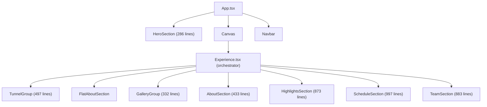

# Utkarsh 2026 — Code Audit & Best Practices Report

> Based on research into current industry standards for React Three Fiber scrollytelling, React architecture patterns, CSS strategies, accessibility, and UX best practices (Feb 2025).

---

## Executive Summary

The project is a **single-page React + Three.js scrollytelling experience** for the Utkarsh 2026 college fest. While it achieves impressive visual results, the codebase has significant structural and maintainability issues that would make it difficult. Here's the breakdown:

| Area | Rating | Verdict |
|------|--------|---------|
| Folder Structure | ⚠️ Needs Work | Flat, no feature-based organization |
| Architecture | ⚠️ Needs Work | Monolithic components, tight coupling |
| Coding Patterns | 🔴 Poor | God components, mixed concerns |
| CSS Strategy | 🔴 Poor | Template literal CSS-in-JS, no scoping |
| State Management | ⚠️ Needs Work | No centralized state, DOM polling hacks |
| Performance | ⚠️ Mixed | Good ref usage, but missing key optimizations |
| Accessibility | 🔴 Missing | Zero a11y consideration |
| UX Patterns | ⚠️ Risky | Scroll hijacking, keyboard traps |
| Modularity | 🔴 Poor | No reusable components, everything bespoke |

---

## 1. Folder Structure

### Current State
```
src/
├── App.tsx
├── main.tsx
├── components/
│   ├── canvas/          (Experience, SceneSetup)
│   ├── overlays/        (Hero, Navbar, GalleryOverlay)
│   ├── sections/
│   │   ├── tunnel/
│   │   ├── about/
│   │   ├── gallery/     (7 files!)
│   │   ├── schedule/
│   │   └── team/
│   ├── effects/
│   └── ErrorBoundary, PerformanceMonitor
├── config/              (timeline, scroll, scene, animation, transition)
├── data/                (content, gallery, highlights, schedule, team)
├── hooks/               (3 files)
├── styles/              (colors.css, breakpoints.css)
├── types/               (4 files)
└── utils/               (1 file)
```

### Problems

- **No feature-based grouping** — Data, styles, types, and components for the same feature (e.g., "schedule") are scattered across 4+ directories. To understand the schedule feature, you must look in `components/sections/schedule/`, `data/schedule.ts`, `styles/`, `types/`, and `config/timeline.ts`.
- **Styles directory is barely used** — Only 2 CSS files exist in `styles/`. The bulk of styling is 400+ line template literals inside component files.
- **No shared/common components** — There's no `components/common/` or `components/ui/` directory for reusable primitives (buttons, cards, modals, overlays).

### Industry Standard

```
src/
├── app/                 (App.tsx, main.tsx, global layout)
├── features/            ← Feature-based organization
│   ├── hero/
│   │   ├── HeroSection.tsx
│   │   ├── HeroSection.module.css
│   │   └── index.ts
│   ├── tunnel/
│   │   ├── TunnelGroup.tsx
│   │   ├── hooks/useTunnelAnimation.ts
│   │   ├── TunnelTile.tsx
│   │   └── tunnel.data.ts
│   ├── schedule/
│   │   ├── ScheduleSection.tsx
│   │   ├── ScheduleCard.tsx
│   │   ├── ScheduleModal.tsx
│   │   ├── ScheduleGrid.tsx
│   │   ├── schedule.data.ts
│   │   ├── schedule.types.ts
│   │   └── ScheduleSection.module.css
│   └── ...
├── components/          ← Shared, reusable primitives
│   ├── ui/              (Button, Card, Modal, Badge)
│   ├── layout/          (Navbar, Footer, Section wrapper)
│   └── three/           (SceneSetup, ScrollProvider)
├── hooks/               ← App-wide custom hooks
├── config/              ← Global configuration
├── styles/              ← Design tokens, global CSS
├── types/               ← Shared type definitions
└── utils/               ← Pure utility functions
```

**Key principle**: *Colocation* — keep styles, data, hooks, and tests next to the component they belong to.

---

## 2. Architecture

### Current State



### Problems

1. **God Components** — Multiple files exceed 500 lines, some nearly 1000. `ScheduleSection.tsx` is **997 lines** with rendering, state management, event handling, CSS, and animation logic all in one file.

2. **No separation of concerns** — Each section component handles:
   - Scroll position reading (`useScroll`)
   - Animation calculations (`useFrame`)
   - State management (`useState`)
   - Event handling (keyboard, wheel, mouse)
   - DOM manipulation (refs, portals)
   - Styling (inline CSS template literals)
   - Data transformation
   
   These should be separated into distinct layers.

3. **Tight coupling to scroll values** — Every section directly imports `TIMELINE` constants and computes its own visibility/opacity. There's no abstraction layer like a `useScrollSection(start, end)` hook.

4. **No scroll orchestration layer** — The `Experience.tsx` is just a flat list of components. There's no central controller that manages which sections are active, handles transitions, or provides scroll context.

### Industry Standard

```
┌─────────────────────────────────────────┐
│  Scroll Orchestrator (Zustand Store)     │
│  - Current section index                 │
│  - Transition progress                   │
│  - Active section visibility map         │
│  - prefers-reduced-motion state          │
└────────────┬────────────────────────────┘
             │
    ┌────────┴──────────┐
    │  Section Wrapper   │  ← Shared HOC/hook
    │  - Fade in/out     │
    │  - Visibility      │
    │  - Scroll range    │
    └────────┬──────────┘
             │
    ┌────────┴──────────────────┐
    │  Feature Component        │  ← Only business logic
    │  - Pure rendering         │
    │  - Receives progress prop │
    │  - No scroll awareness    │
    └───────────────────────────┘
```

**Key pattern**: Section components should receive their local progress (0→1 within their range) as a prop, not compute it themselves.

---

## 3. Coding Patterns

### Problems Found

#### 3.1 DOM Polling Anti-Pattern
```typescript
// HeroSection.tsx — polling for drei's scroll container
const findScrollContainer = (): HTMLElement | null => {
    const candidates = document.querySelectorAll('div[style]');
    for (const el of candidates) {
        const style = (el as HTMLElement).style;
        if (style.overflow === 'auto' || style.overflowY === 'auto') ...
    }
};
setInterval(() => {
    scrollContainer = findScrollContainer(); // Polling every 100ms!
}, 100);
```

This is a hack. The Hero section lives outside the Canvas and has no access to drei's scroll state, so it **polls the DOM every 100ms** looking for a scrollable div by inspecting inline styles. This is fragile and will break if drei changes its internal markup.

**Fix**: Use a shared state store (Zustand) where the scroll orchestrator publishes the scroll offset, and any component (inside or outside Canvas) can subscribe.

#### 3.2 Inline State Machines Without Types
```typescript
// TeamSection.tsx — state machine defined as string literal
type TrapState = 'ENTERING' | 'BROWSING' | 'EXITING' | 'RELEASED';
```

The scroll-trap state machine in `TeamSection` is implemented with raw string comparisons scattered throughout a 500-line function body. No state machine library, no transition validation.

**Fix**: Use a proper state machine pattern (XState or a reducer) with typed transitions.

#### 3.3 Mixed Rendering Strategies
The project uses **3 different rendering strategies** for HTML content:
1. **Fixed positioned divs** (`HeroSection`, `Navbar`) — outside Canvas, z-indexed
2. **`<Scroll html>`** (`AboutSection`, `GalleryOverlay`) — inside drei's scroll container
3. **`createPortal`** (`ScheduleSection`, `TeamSection`) — portaled to `document.body`

Each strategy has different scroll behavior, z-index management, and event handling. There's no consistency or abstraction.

#### 3.4 No Custom Hooks for Complex Logic
Complex animation and interaction logic is embedded directly in components. For example, in `HighlightsSection.tsx`:
- A full particle spawning system (collision detection, weighted random picking, 3-layer depth management) — **all inline** in the component
- Should be extracted to: `useParticleSystem()`, `useSpawnManager()`, `useMouseParallax()`

---

## 4. CSS Strategy

### Current State — 3 Conflicting Approaches

| Approach | Where Used | Lines of CSS |
|----------|-----------|-------------|
| TailwindCSS CDN | Hero, Navbar, App | ~50 classes |
| Inline `style={{}}` | AboutSection, GalleryOverlay, Hero | Scattered |
| Template literal `<style>` injection | ScheduleSection, TeamSection | ~800+ lines |

### Problems

1. **TailwindCSS via CDN** — The entire Tailwind library is loaded via `<script src="https://cdn.tailwindcss.com">`. This:
   - Adds ~300KB+ of JavaScript to parse and generate styles at runtime
   - Is explicitly marked "for development only" by Tailwind — **not for production**
   - Doesn't benefit from tree-shaking or purging
   - Doesn't work offline

2. **Template literal CSS injection** — `ScheduleSection` and `TeamSection` define 400+ lines of CSS as JavaScript template literals that are injected into `<style>` tags on mount. This:
   - Has zero type safety
   - No syntax highlighting or linting in most editors
   - Styles are re-parsed on every mount/remount
   - No scoping — class names like `.sch-card` could collide
   - Cannot be cached by the browser separately from JS

3. **Mixed inline styles** — `GalleryOverlay` and `AboutSection` use React inline `style={{}}` objects, which:
   - Cannot handle pseudo-classes (`:hover`, `::before`)
   - Cannot handle media queries
   - Create new objects every render (minor perf cost)
   - Are the least maintainable approach

### Industry Standard

**CSS Modules** are the recommended approach for Vite + React projects:

```typescript
// ScheduleSection.module.css
.card { /* scoped automatically */ }
.card:hover { transform: scale(1.02); }

// ScheduleSection.tsx
import styles from './ScheduleSection.module.css';
<div className={styles.card}>...</div>
```

Benefits:
- Build-time scoping (unique class names, zero collisions)
- Zero runtime overhead
- Full CSS syntax support (pseudo-classes, media queries, animations)
- Works with Vite out of the box — no config needed
- Cacheable as separate `.css` files

If you need dynamic values, combine CSS Modules with CSS custom properties:
```css
.card { transform: rotateX(var(--tilt)); }
```
```tsx
<div className={styles.card} style={{ '--tilt': `${tilt}deg` } as React.CSSProperties} />
```

---

## 5. State Management

### Current State

**No state management solution.** Each component manages its own state independently:
- `useState` for local UI state (selected day, active member index, modal open)
- `useRef` for animation state (scroll position, damped values, timers)
- Direct DOM queries to find other components' elements

### Problems

1. **No shared scroll state** — Hero (outside Canvas) polls the DOM to read scroll position. Schedule and Team use `createPortal` to escape the Canvas. None of them can communicate scroll state cleanly.

2. **No global theme/mode** — No dark/light mode toggle, no reduced-motion preference, no quality settings propagation.

3. **Cross-section state** — When the Team section needs to know if Schedule has fully faded out, it re-computes from raw scroll offset. There's no concept of "the active section changed."

### Industry Standard

Use **Zustand** (lightweight, R3F's own internal state manager):

```typescript
// store/useScrollStore.ts
import { create } from 'zustand';

interface ScrollStore {
    offset: number;
    activeSection: string;
    sectionProgress: Record<string, number>;
    setOffset: (v: number) => void;
    prefersReducedMotion: boolean;
}

export const useScrollStore = create<ScrollStore>((set) => ({
    offset: 0,
    activeSection: 'hero',
    sectionProgress: {},
    setOffset: (offset) => set({ offset }),
    prefersReducedMotion: window.matchMedia('(prefers-reduced-motion: reduce)').matches,
}));
```

This allows **any component** (inside or outside Canvas) to read scroll state without DOM polling.

---

## 6. Performance

### What's Done Well ✅

- **`useRef` for animation state** — Correctly avoids `setState` in `useFrame` loops
- **Direct DOM mutation** in Hero section — bypasses React reconciliation for 60fps
- **Object pooling** in Tunnel — tiles are recycled, not created/destroyed
- **`dpr={[1, 2]}`** on Canvas — adaptive pixel ratio
- **Visibility toggling** — sections set `visible = false` when off-screen

### What's Missing ❌

| Issue | Impact | Fix |
|-------|--------|-----|
| No `useMemo` for geometries | Tunnel creates `createCurvedTileGeometry` every re-render | Wrap in `useMemo` |
| No `React.memo` on sections | All sections re-render when parent updates | Wrap in `React.memo` |
| No instancing for tunnel tiles | Each tile = separate draw call | Use `<Instances>` from drei |
| No lazy loading of sections | All 873-line HighlightsSection loads upfront | `React.lazy()` + `Suspense` |
| No image lazy loading | All gallery/highlight images load simultaneously | `loading="lazy"` or `IntersectionObserver` |
| No asset preloading | Textures load when section becomes visible | `useTexture.preload()` |
| CDN Tailwind runtime | ~300KB parsed at runtime | Install properly or remove |
| No `frameloop="demand"` | Canvas renders every frame even when static | Use on-demand + `invalidate()` |
| No `will-change` cleanup | Elements keep `will-change` permanently | Remove after animation completes |
| 10MB hero video | No compression, no format alternatives | Add WebM, use `<source>` fallbacks |

---

## 7. Accessibility (A11Y)

### Current State: **Zero accessibility implementation**

This is the most critical gap. The site would fail WCAG 2.1 on virtually every criterion:

| Issue | WCAG | Current |
|-------|------|---------|
| No semantic HTML | 1.3.1 | Everything is `<div>`. No `<main>`, `<section>`, `<nav>`, `<article>`, `<header>` |
| No headings structure | 1.3.1 | `<h1>` inside Hero, nothing else has heading hierarchy |
| No alt text on images | 1.1.1 | Team photos, gallery images, highlights — all missing `alt` |
| No keyboard navigation | 2.1.1 | Schedule cards, team navigation — mouse only |
| Scroll hijacking | 2.1.2 | Team section **traps** keyboard/scroll input |
| No skip links | 2.4.1 | No way to skip past tunnel animation |
| No focus indicators | 2.4.7 | Hidden scrollbar, no visible focus states |
| No `prefers-reduced-motion` | 2.3.3 | Zero motion reduction — everything animates |
| No ARIA labels | 4.1.2 | Day tabs, nav buttons, modals — unlabeled |
| Color contrast | 1.4.3 | White text on transparent overlays — likely fails |
| No loading state | 3.2.1 | Suspense fallback is `null` — blank screen |

### Minimum Fixes Required

```tsx
// 1. Semantic HTML
<main role="main">
  <section aria-label="Hero">...</section>
  <section aria-label="About Utkarsh">...</section>

// 2. Reduced motion
const prefersReducedMotion = window.matchMedia('(prefers-reduced-motion: reduce)').matches;
if (prefersReducedMotion) {
    // Skip tunnel animation, show static content
    // Disable parallax and floating images
}

// 3. Skip link
<a href="#main-content" className="skip-link">Skip to content</a>

// 4. Alt text


// 5. ARIA on interactive elements
<button aria-label={`Select Day ${day}`} role="tab" aria-selected={activeDay === day}>
```

---

## 8. UX Patterns

### Current Anti-Patterns

#### 8.1 Scroll Hijacking (Team Section)
The Team section implements a **scroll trap** — a state machine that intercepts wheel events, prevents default scrolling, and forces the user to navigate through each team member before releasing control. This is a well-documented UX anti-pattern:

> *"Users expect consistent and predictable scrolling. When this is disrupted, they feel trapped and frustrated, leading to damaged user experience and trust."*

**Fix**: Instead of trapping scroll, use a **sticky section** with `position: sticky` and CSS `scroll-snap-type`. The team members can cycle based on scroll position within the sticky container without hijacking the wheel event.

#### 8.2 No Progress Indicator
With **40 virtual scroll pages**, users have no idea how far along they are or how much content remains. The scrollbar is hidden (`scrollbar-width: 0`).

**Fix**: Add a subtle progress bar or section dots indicator.

#### 8.3 No Content Length Signal
The Void section (14% of scroll) shows pure black — users may think the page is broken or has finished loading.

**Fix**: Add a subtle loading/transition animation or reduce void duration.

#### 8.4 Forced Linear Navigation
Users cannot jump to a specific section (e.g., "Schedule"). They must scroll through the entire tunnel and gallery sequence.

**Fix**: Add section links in the Navbar.

#### 8.5 No Mobile Optimization
- 10MB hero video on mobile connections
- No touch gesture handling
- No viewport-based responsive breakpoints in scroll calculations
- Gallery 3D cylinder may not render well on mobile GPUs

---

## 9. Modularity

### Current State

**Zero reusable components.** Every section is a self-contained monolith:

```
ScheduleSection.tsx = 997 lines =
    CSS (400 lines) +
    State Machine (50 lines) +
    Event Handlers (80 lines) +
    Card Rendering (150 lines) +
    Modal Rendering (200 lines) +
    Grid Layout (50 lines) +
    Scroll Logic (70 lines)
```

### What Should Be Extracted

```
schedule/
├── ScheduleSection.tsx          (~80 lines — composition only)
├── ScheduleSection.module.css   (~250 lines — scoped CSS)
├── components/
│   ├── DayTabs.tsx              (~40 lines)
│   ├── EventCard.tsx            (~60 lines)
│   ├── EventGrid.tsx            (~30 lines)
│   ├── EventModal.tsx           (~120 lines)
│   └── ScanlineOverlay.tsx      (~15 lines)
├── hooks/
│   ├── useScheduleScroll.ts     (scroll visibility logic)
│   └── useEventNavigation.ts    (keyboard + modal nav)
├── schedule.data.ts             (event data)
└── schedule.types.ts            (TypeScript interfaces)
```

### Reusable Components That Should Exist (but don't)

| Component | Used By | Currently |
|-----------|---------|-----------|
| `<FadeSection>` | Every section | Each reimplements fade in/out |
| `<ScrollPortal>` | Schedule, Team | Each does `createPortal` + scroll logic |
| `<Modal>` | Schedule | Bespoke 200-line modal |
| `<ImageCard>` | Schedule, Highlights | Each has its own card impl |
| `<GradientText>` | Hero, About | Each does inline gradient CSS |
| `<ProgressDots>` | Gallery, Team | Each has its own indicator |
| `<AnimatedCounter>` | About | Inline custom hook |

---

## Summary of Priority Fixes

### 🔴 Critical (do first)

1. **Remove TailwindCSS CDN** — replace with properly installed Tailwind or CSS Modules
2. **Add `prefers-reduced-motion` support** — accessibility & legal requirement
3. **Add semantic HTML** — `<main>`, `<section>`, `<nav>`, `<article>`, `aria-label`
4. **Extract CSS from template literals** → CSS Modules
5. **Compress hero video** — 10MB is too large; add WebM + responsive sources

### ⚠️ Important (do next)

6. **Break down god components** — ScheduleSection (997 lines) → 6+ smaller components
7. **Add Zustand** for shared scroll state — eliminate DOM polling hack
8. **Create `useScrollSection` hook** — centralize fade-in/out, visibility, progress
9. **Create reusable `<FadeSection>`, `<Modal>`, `<ScrollPortal>`** components
10. **Restructure to feature-based folders** 

### 💡 Nice to Have

11. Add GSAP for timeline orchestration (more robust than raw `useFrame` math)
12. Add Lenis for smoother scroll feel
13. Add section navigation in Navbar
14. Add progress indicator
15. Replace scroll trap with `scroll-snap` or sticky positioning
16. Add `React.lazy` + code splitting per section
17. Add Three.js instancing for tunnel tiles
